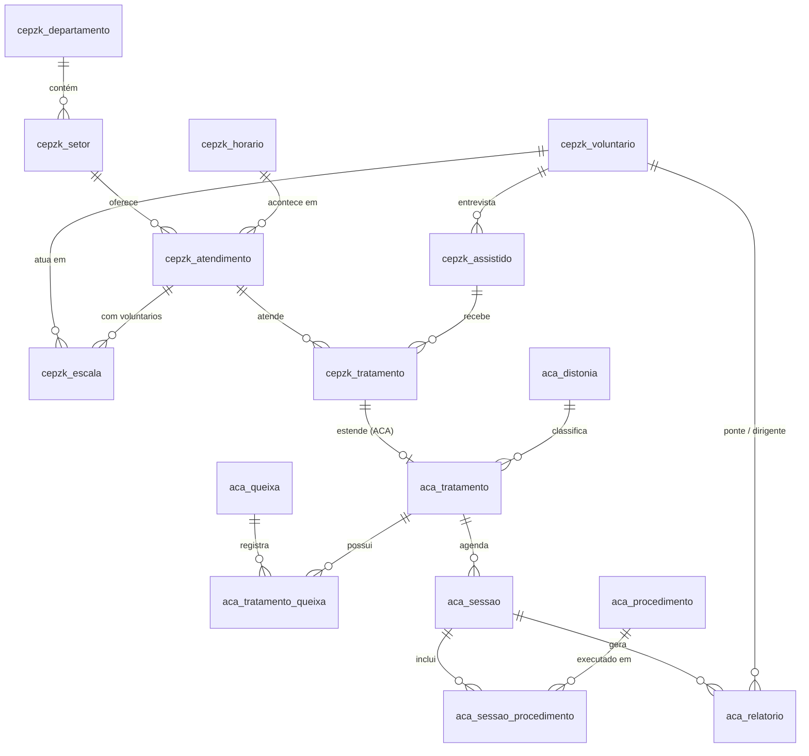

# Banco de dados

Documentação do esquema do banco de dados do sistema de atendimentos da
CEPZK, hospedado no [Supabase](https://supabase.com).

## Visão geral

O banco é dividido em dois domínios:

- **`cepzk_*`** — estrutura geral: departamentos, setores, horários,
  atendimentos, voluntários, assistidos e tratamentos;
- **`aca_*`** — extensões específicas do tratamento **Acolher com Amor
  (ACA)**: distonias, queixas, procedimentos, agenda de sessões e
  relatórios.

### Diagrama (ERD)

## Tabelas

### Catálogos

#### `cepzk_departamento`

Departamentos do centro (ex.: Atendimento Fraterno, Fluidoterapia,
Mediúnico).

| Coluna  | Tipo         | Observação        |
| ------- | ------------ | ----------------- |
| `id`    | `smallserial`| PK                |
| `nome`  | `text`       | `not null`        |

#### `cepzk_setor`

Setores de atendimento, cada um pertencente a um departamento
(ex.: Acolher com Amor, Desobsessão Infantil I).

| Coluna                   | Tipo          | Observação        |
| ------------------------ | ------------- | ----------------- |
| `id`                     | `smallserial` | PK                |
| `nome`                   | `text`        | `not null`        |
| `departamento_id`        | `smallint`    | FK → departamento |

**Mapeamento setor → departamento (seed):**

| Setor                   | Departamento         |
| ----------------------- | -------------------- |
| Atendimento Fraterno    | Atendimento Fraterno |
| Desobsessão Infantil I  | Mediúnico            |
| Desobsessão Infantil II | Mediúnico            |
| Acolher com Amor        | Fluidoterapia        |

#### `cepzk_horario`

Horários de atendimento (ex.: Terça-Feira 8h, Sábado 9h30).

| Coluna | Tipo          | Observação |
| ------ | ------------- | ---------- |
| `id`   | `smallserial` | PK         |
| `nome` | `text`        | `not null` |

#### `cepzk_atendimento`

**Atendimentos oferecidos pela casa**: cada linha é uma combinação
setor + horário que realmente acontece. É o que escala e tratamento
referenciam — assim não é possível registrar uma combinação inexistente
(ex.: Acolher com Amor na Terça-Feira 8h).

| Coluna        | Tipo          | Observação                        |
| ------------- | ------------- | --------------------------------- |
| `id`          | `smallserial` | PK                                |
| `setor_id`    | `smallint`    | FK → setor                        |
| `horario_id`  | `smallint`    | FK → horário                      |
| `precedencia` | `smallint`    | Opcional (`null`) — prioridade do tratamento (menor = mais prioritário) |

`unique (setor_id, horario_id)` impede o mesmo horário repetido no setor.

A `precedencia` era `cepzk_setor.precedencia_tratamento` e passou a viver
aqui: assim dois horários do mesmo setor podem ter prioridades diferentes.
Na migração, cada atendimento herdou a precedência do seu setor.

**Atendimentos (seed):**

| Setor                   | Horário           | Precedência |
| ----------------------- | ----------------- | ----------- |
| Atendimento Fraterno    | Terça-Feira 8h    | 0           |
| Atendimento Fraterno    | Sexta-Feira 19h   | 0           |
| Desobsessão Infantil I  | Sexta-Feira 19h30 | 1           |
| Desobsessão Infantil II | Sexta-Feira 19h30 | 1           |
| Acolher com Amor        | Sábado 9h30       | 10          |

### Voluntários

#### `cepzk_voluntario`

Espelho 1:1 do usuário no **Supabase Auth**: o `id` é o mesmo `uuid` de
`auth.users.id`. O registro é criado automaticamente no momento do
convite (veja [autenticacao.md](autenticacao.md#perfil-do-voluntario)).

| Coluna         | Tipo                 | Observação                                                        |
| -------------- | -------------------- | ----------------------------------------------------------------- |
| `id`           | `uuid`               | PK = `auth.users.id`                                              |
| `nome`         | `text`               | `not null` — sincronizado com o Auth                              |
| `sobrenome`    | `text`               | Opcional — preenchido pelo próprio voluntário                     |
| `email`        | `text`               | `not null unique` — o admin usa para enviar o convite. Sincronizado com o Auth |
| `telefone`     | `text`               | Preenchido pelo próprio voluntário                                |
| `papel`        | `papel_voluntario`   | `admin` / `coordenador` / `colaborador` (default `colaborador`)   |
| `data_criacao` | `timestamptz`        | `not null default now()`                                          |

O tipo `papel_voluntario` é um `enum` do Postgres com os três papéis.
Somente `admin` envia convites e altera papéis — um trigger
(`on_voluntario_papel_protected`) **reverte** qualquer alteração de
`papel` feita por quem não é admin (o `service_role` das Edge Functions
e o dono da tabela, usado na administração local, são liberados).

#### `cepzk_escala`

Escala: os atendimentos (setor + horário) em que cada voluntário atua.

| Coluna           | Tipo       | Observação             |
| ---------------- | ---------- | ---------------------- |
| `voluntario_id`  | `uuid`     | FK → voluntário (PK)   |
| `atendimento_id` | `smallint` | FK → atendimento (PK)  |

### Assistidos e tratamentos

#### `cepzk_assistido`

Pessoa assistida, cadastrada pelo entrevistador após a entrevista do
Atendimento Fraterno.

| Coluna               | Tipo        | Observação                          |
| -------------------- | ----------- | ----------------------------------- |
| `id`                 | `serial`    | PK                                  |
| `nome_completo`      | `text`      | `not null unique`                   |
| `entrevistador_id`   | `uuid`      | FK → voluntário (quem entrevistou)  |
| `data_criacao`       | `timestamptz` | `not null default now()`         |
| `data_arquivamento`  | `timestamptz` | Opcional (`null`) — data/hora em que o assistido foi arquivado; `null` indica que está ativo |

#### `cepzk_tratamento`

Tratamento que o assistido recebe em um atendimento (setor + horário).
O `estado` acompanha o ciclo do tratamento — nasce `'pendente'` e o
voluntário o marca como completo quando o assistido recebe alta.

| Coluna           | Tipo       | Observação                            |
| ---------------- | ---------- | ------------------------------------- |
| `id`             | `serial`   | PK                                    |
| `assistido_id`   | `int`      | FK → assistido (`on delete cascade`)  |
| `atendimento_id` | `smallint` | FK → atendimento                      |
| `obs`            | `text`     | Observações livres                    |
| `estado`         | `text`     | `not null default 'pendente'`         |
| `data_atualizacao` | `timestamptz` | `not null default now()` — atualizada pela aplicação a cada `update` |
| `data_arquivamento` | `timestamptz` | Opcional (`null`) — data/hora em que o tratamento foi arquivado; `null` indica que está ativo |

**Não** há restrição `unique` em `(assistido_id, atendimento_id)`: essa regra
é responsabilidade da aplicação, que só permite criar um novo tratamento para
o mesmo par (assistido, atendimento) se o existente estiver **arquivado**
(`data_arquivamento` preenchido). Assim o histórico de tratamentos arquivados
é preservado. Existe apenas um índice (não único) em
`(assistido_id, atendimento_id)` para consultas.

Também **não** há restrição por setor: o assistido pode ter tratamentos no
mesmo setor em horários diferentes.

### Acolher com Amor (ACA)

#### `aca_distonia`

Classificação da distonia do caso (ex.: TEA, Esquizofrenia, Outros).

| Coluna | Tipo          | Observação     |
| ------ | ------------- | -------------- |
| `id`   | `smallserial` | PK             |
| `nome` | `text`        | `not null unique` |

#### `aca_queixa`

Queixas/condições do caso (ex.: Convulsão, Dificuldade de Comunicação).

| Coluna | Tipo          | Observação     |
| ------ | ------------- | -------------- |
| `id`   | `smallserial` | PK             |
| `nome` | `text`        | `not null unique` |

#### `aca_tratamento`

Extensão **1:1** do `cepzk_tratamento` para os casos do ACA: guarda a
distonia do assistido em tratamento.

| Coluna        | Tipo     | Observação              |
| ------------- | -------- | ----------------------- |
| `id`          | `int`    | PK = FK → tratamento (`on delete cascade`) |
| `distonia_id` | `smallint` | FK → distonia         |

#### `aca_tratamento_queixa`

Liga tratamentos do ACA às queixas registradas (N:M).

| Coluna        | Tipo       | Observação          |
| ------------- | ---------- | ------------------- |
| `tratamento_id` | `int`    | FK → tratamento (PK, `on delete cascade`) |
| `queixa_id`   | `smallint` | FK → queixa (PK)   |

#### `aca_procedimento`

Procedimentos que podem ser realizados em uma sessão
(ex.: TEA Geral, Distonias Mentais Geral, Convulsões).

| Coluna | Tipo          | Observação     |
| ------ | ------------- | -------------- |
| `id`   | `smallserial` | PK             |
| `nome` | `text`        | `not null unique` |

#### `aca_sessao`

**Agenda de sessões** de cada assistido em tratamento no ACA. Cada sessão
pertence a um tratamento e tem data/hora agendada.

| Coluna        | Tipo          | Observação                  |
| ------------- | ------------- | --------------------------- |
| `id`          | `serial`      | PK                          |
| `tratamento_id` | `int`       | FK → tratamento (`on delete cascade`) |
| `data`        | `timestamptz` | `not null` — data/hora agendada |

#### `aca_sessao_procedimento`

Procedimentos realizados em cada sessão (N:M).

| Coluna          | Tipo       | Observação               |
| --------------- | ---------- | ------------------------ |
| `sessao_id`     | `int`      | FK → sessão (PK, `on delete cascade`) |
| `procedimento_id` | `smallint` | FK → procedimento (PK) |

#### `aca_relatorio`

Relatório de cada sessão, com os voluntários responsáveis.

| Coluna         | Tipo        | Observação                |
| -------------- | ----------- | ------------------------- |
| `id`           | `serial`    | PK                        |
| `sessao_id`    | `int`       | FK → sessão (`on delete cascade`) |
| `ponte_id`     | `uuid`      | FK → voluntário (médium/ponte) |
| `dirigente_id` | `uuid`      | FK → voluntário (dirigente da sessão) |
| `obs`          | `text`      | Observações do relatório  |
| `data_criacao` | `timestamptz` | `not null default now()` |

## Convenções

- **Tipos:** `smallserial`/`smallint` para catálogos de pequeno porte;
  `serial`/`int` para dados transacionais; `uuid` para qualquer referência a
  usuário do Auth.
- **Cascates:** excluir um assistido remove em cascata seus tratamentos e a
  estrutura ACA correspondente (extensão, queixas, sessões, relatórios).
  Excluir um voluntário remove sua escala (`cepzk_escala`). As FKs
  que apontam para voluntários em dados transacionais (entrevistador, ponte,
  dirigente) **não** fazem cascade — a exclusão falha enquanto houver
  referências (preserva histórico).
- **Nomenclatura:** nomes de tabelas/colunas em português, prefixo do domínio
  (`cepzk_` / `aca_`); índices `*_idx` em inglês.
- **Data/hora:** sempre `timestamptz` (fuso do servidor do Supabase; a
  aplicação converte para o fuso local do usuário).

## Dados de referência (seed)

A migration `20260831000002_seed_reference_data.sql` popula os catálogos de
forma idempotente:

| Catálogo          | Valores iniciais                                                    |
| ----------------- | ------------------------------------------------------------------- |
| Departamentos     | Atendimento Fraterno, Fluidoterapia, Mediúnico                      |
| Setores           | Atendimento Fraterno, Acolher com Amor, Desobsessão Infantil I/II   |
| Horários          | Terça-Feira 8h, Terça-Feira 20h, Sexta-Feira 19h, Sexta-Feira 19h30, Sábado 9h30 |
| Atendimentos      | AF Terça-Feira 8h (0), AF Sexta-Feira 19h (0), DI I e DI II Sexta-Feira 19h30 (1), ACA Sábado 9h30 (10) — entre parênteses, a precedência |
| Distonias         | TEA, Esquizofrenia, Outros                                          |
| Queixas           | Convulsão, Dificuldade de Comunicação, Dificuldade de Interação Social, Comportamentos Repetitivos, Comportamentos Violentos |
| Procedimentos     | TEA Geral, Distonias Mentais Geral, Esquizofrenia, Convulsões       |

O horário `Terça-Feira 8h` e os atendimentos vêm da migration
`20260901000005_create_atendimento.sql`; os demais catálogos, da `002`.
`Terça-Feira 20h` permanece no catálogo de horários, hoje sem atendimento
vinculado.

Novos valores podem ser inseridos diretamente pela aplicação ou SQL — as
FKs já permitem o uso imediato.

## Migrations

| Arquivo                          | Conteúdo                              |
| -------------------------------- | ------------------------------------- |
| `20260831000001_create_schema.sql` | Tabelas, enum `papel_voluntario`, FKs e índices |
| `20260831000002_seed_reference_data.sql` | Dados de referência (catálogos iniciais) |
| `20260831000003_row_level_security.sql` | RLS + políticas                 |
| `20260831000004_auth_hooks.sql`  | Triggers de criação/sincronização do voluntário |
| `20260901000005_create_atendimento.sql` | Catálogo `cepzk_atendimento` + seed; escala e tratamento passam a usar `atendimento_id`; precedência sai do setor (migra os dados existentes) |
| `20260901000006_add_data_atualizacao_tratamento.sql` | `cepzk_tratamento.data_atualizacao` |
| `20260903000007_add_data_arquivamento_assistido.sql` | `cepzk_assistido.data_arquivamento` |
| `20260903000008_add_data_arquivamento_tratamento.sql` | `cepzk_tratamento.data_arquivamento` |
| `20260903000009_drop_unique_tratamento.sql` | Remove o `unique (assistido_id, atendimento_id)` de `cepzk_tratamento` (regra passa para a aplicação: novo tratamento só se o existente estiver arquivado) |

> A `005` preserva o histórico: toda combinação setor + horário já usada em
> `cepzk_escala`/`cepzk_tratamento` vira um atendimento antes das colunas
> antigas serem removidas — nenhum registro se perde.

Para aplicar em um projeto existente, veja
[README.md → Começando](../README.md#começando).
