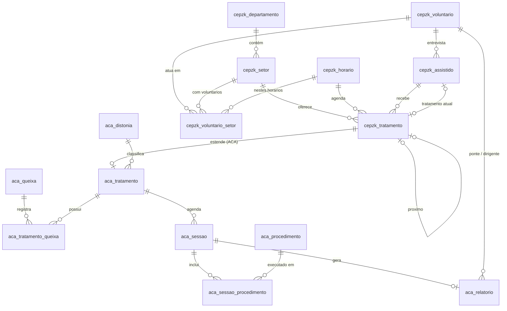

# Banco de dados

Documentação do esquema do banco de dados do sistema de atendimentos da
CEPZK, hospedado no [Supabase](https://supabase.com).

## Visão geral

O banco é dividido em dois domínios:

- **`cepzk_*`** — estrutura geral: departamentos, setores, horários,
  voluntários, assistidos e tratamentos;
- **`aca_*`** — extensões específicas do tratamento **Acolher com Amor
  (ACA)**: distonias, queixas, procedimentos, agenda de sessões e
  relatórios.

### Diagrama (ERD)

## Tabelas

### Catálogos

#### `cepzk_departamento`

Departamentos do centro (ex.: Atendimento Fraterno, Fluidoterapia,
Mediúnico).

| Coluna  | Tipo         | Observação        |
| ------- | ------------ | ----------------- |
| `id`    | `smallserial`| PK                |
| `nome`  | `text`       | `not null`        |

#### `cepzk_setor`

Setores de atendimento, cada um pertencente a um departamento
(ex.: Acolher com Amor, Desobsessão Infantil I).

| Coluna            | Tipo         | Observação        |
| ----------------- | ------------ | ----------------- |
| `id`              | `smallserial`| PK                |
| `nome`            | `text`       | `not null`        |
| `departamento_id` | `smallint`   | FK → departamento |

**Mapeamento setor → departamento (seed):**

| Setor                     | Departamento         |
| ------------------------- | -------------------- |
| Atendimento Fraterno      | Atendimento Fraterno |
| Acolher com Amor          | Fluidoterapia        |
| Desobsessão Infantil I    | Mediúnico            |
| Desobsessão Infantil II   | Mediúnico            |

#### `cepzk_horario`

Horários de atendimento (ex.: Terça-Feira 20h, Sábado 9h30).

| Coluna | Tipo          | Observação |
| ------ | ------------- | ---------- |
| `id`   | `smallserial` | PK         |
| `nome` | `text`        | `not null` |

### Voluntários

#### `cepzk_voluntario`

Espelho 1:1 do usuário no **Supabase Auth**: o `id` é o mesmo `uuid` de
`auth.users.id`. O registro é criado automaticamente no sign-up (veja
[autenticacao.md](autenticacao.md#perfil-do-voluntario)).

| Coluna | Tipo   | Observação                     |
| ------ | ------ | ------------------------------ |
| `id`   | `uuid` | PK = `auth.users.id`           |
| `nome` | `text` | `not null`                     |

#### `cepzk_voluntario_setor`

Escala: nos setores/horários em que cada voluntário atua.

| Coluna        | Tipo     | Observação                 |
| ------------- | -------- | -------------------------- |
| `voluntario_id` | `uuid` | FK → voluntário (PK)       |
| `setor_id`    | `smallint` | FK → setor (PK)          |
| `horario_id`  | `smallint` | FK → horário (PK)        |

### Assistidos e tratamentos

#### `cepzk_assistido`

Pessoa assistida, cadastrada pelo entrevistador após a entrevista do
Atendimento Fraterno.

| Coluna               | Tipo   | Observação                          |
| -------------------- | ------ | ----------------------------------- |
| `id`                 | `serial` | PK                                |
| `nome`               | `text` | `not null unique`                   |
| `entrevistador_id`   | `uuid` | FK → voluntário (quem entrevistou)  |
| `tratamento_atual`   | `int`  | FK → tratamento em andamento        |

#### `cepzk_tratamento`

Tratamento que o assistido recebe em um setor/horário. Os tratamentos podem
ser encadeados via `proximo_tratamento` (fila de tratamentos do assistido).
`unique (assistido_id, setor_id)` impede dois tratamentos no mesmo setor para
o mesmo assistido.

| Coluna               | Tipo       | Observação                       |
| -------------------- | ---------- | -------------------------------- |
| `id`                 | `serial`   | PK                               |
| `assistido_id`       | `int`      | FK → assistido (`on delete cascade`) |
| `setor_id`           | `smallint` | FK → setor                       |
| `horario_id`         | `smallint` | FK → horário                     |
| `obs`                | `text`     | Observações livre                |
| `proximo_tratamento` | `int`      | FK → tratamento (próximo da fila)|

> **Dependência circular:** `assistido.tratamento_atual → tratamento.id` e
> `tratamento.assistido_id → assistido.id`. No Postgres, as duas tabelas são
> criadas primeiro e as FKs são adicionadas depois (migration 001).

### Acolher com Amor (ACA)

#### `aca_distonia`

Classificação da distonia do caso (ex.: TEA, Esquizofrenia, Outros).

| Coluna | Tipo          | Observação     |
| ------ | ------------- | -------------- |
| `id`   | `smallserial` | PK             |
| `nome` | `text`        | `not null unique` |

#### `aca_queixa`

Queixas/condições do caso (ex.: Convulsão, Dificuldade de Comunicação).

| Coluna | Tipo          | Observação     |
| ------ | ------------- | -------------- |
| `id`   | `smallserial` | PK             |
| `nome` | `text`        | `not null unique` |

#### `aca_tratamento`

Extensão **1:1** do `cepzk_tratamento` para os casos do ACA: guarda a
distonia do assistido em tratamento.

| Coluna        | Tipo     | Observação              |
| ------------- | -------- | ----------------------- |
| `id`          | `int`    | PK = FK → tratamento (`on delete cascade`) |
| `distonia_id` | `smallint` | FK → distonia         |

#### `aca_tratamento_queixa`

Liga tratamentos do ACA às queixas registradas (N:M).

| Coluna        | Tipo       | Observação          |
| ------------- | ---------- | ------------------- |
| `tratamento_id` | `int`    | FK → tratamento (PK, `on delete cascade`) |
| `queixa_id`   | `smallint` | FK → queixa (PK)   |

#### `aca_procedimento`

Procedimentos que podem ser realizados em uma sessão
(ex.: TEA Geral, Distonias Mentais Geral, Convulsões).

| Coluna | Tipo          | Observação     |
| ------ | ------------- | -------------- |
| `id`   | `smallserial` | PK             |
| `nome` | `text`        | `not null unique` |

#### `aca_sessao`

**Agenda de sessões** de cada assistido em tratamento no ACA. Cada sessão
pertence a um tratamento e tem data/hora agendada.

| Coluna        | Tipo          | Observação                  |
| ------------- | ------------- | --------------------------- |
| `id`          | `serial`      | PK                          |
| `tratamento_id` | `int`       | FK → tratamento (`on delete cascade`) |
| `data`        | `timestamptz` | `not null` — data/hora agendada |

#### `aca_sessao_procedimento`

Procedimentos realizados em cada sessão (N:M).

| Coluna          | Tipo       | Observação               |
| --------------- | ---------- | ------------------------ |
| `sessao_id`     | `int`      | FK → sessão (PK, `on delete cascade`) |
| `procedimento_id` | `smallint` | FK → procedimento (PK) |

#### `aca_relatorio`

Relatório de cada sessão, com os voluntários responsáveis.

| Coluna         | Type   | Observação                |
| -------------- | ------ | ------------------------- |
| `id`           | `serial` | PK                      |
| `sessao_id`    | `int`  | FK → sessão (`on delete cascade`) |
| `ponte_id`     | `uuid` | FK → voluntário (médium/ponte) |
| `dirigente_id` | `uuid` | FK → voluntário (dirigente da sessão) |
| `obs`          | `text` | Observações do relatório  |

## Convenções

- **Tipos:** `smallserial`/`smallint` para catálogos de pequeno porte;
  `serial`/`int` para dados transacionais; `uuid` para qualquer referência a
  usuário do Auth.
- **Cascates:** excluir um assistido remove em cascata seus tratamentos e a
  estrutura ACA correspondente (extensão, queixas, sessões, relatórios).
  Excluir um voluntário remove sua escala (`cepzk_voluntario_setor`). As FKs
  que apontam para voluntários em dados transacionais (entrevistador, ponte,
  dirigente) **não** fazem cascade — a exclusão falha enquanto houver
  referências (preserva histórico).
- **Nomenclatura:** nomes de tabelas/colunas em português, prefixo do domínio
  (`cepzk_` / `aca_`); índices `*_idx` em inglês.
- **Data/hora:** sempre `timestamptz` (fuso do servidor do Supabase; a
  aplicação converte para o fuso local do usuário).

## Dados de referência (seed)

A migration `20260831000002_seed_reference_data.sql` popula os catálogos de
forma idempotente:

| Catálogo          | Valores iniciais                                                    |
| ----------------- | ------------------------------------------------------------------- |
| Departamentos     | Atendimento Fraterno, Fluidoterapia, Mediúnico                      |
| Setores           | Atendimento Fraterno, Acolher com Amor, Desobsessão Infantil I/II   |
| Horários          | Terça-Feira 20h, Sexta-Feira 19h, Sexta-Feira 19h30, Sábado 9h30    |
| Distonias         | TEA, Esquizofrenia, Outros                                          |
| Queixas           | Convulsão, Dificuldade de Comunicação, Dificuldade de Interação Social, Comportamentos Repetitivos, Comportamentos Violentos |
| Procedimentos     | TEA Geral, Distonias Mentais Geral, Esquizofrenia, Convulsões       |

Novos valores podem ser inseridos diretamente pela aplicação ou SQL — as
FKs já permitem o uso imediato.

## Migrations

| Arquivo                          | Conteúdo                              |
| -------------------------------- | ------------------------------------- |
| `20260831000001_create_schema.sql` | Tabelas, FKs e índices               |
| `20260831000002_seed_reference_data.sql` | Dados de referência            |
| `20260831000003_row_level_security.sql` | RLS + políticas                 |
| `20260831000004_auth_hooks.sql`  | Trigger de criação do voluntário      |
| `20260831000005_seed_setor_mediunico.sql` | Setor Mediúnico no seed        |
| `20260831000006_fix_setor_departamento_mapping.sql` | Mapeamento definitivo setor→departamento |

Para aplicar em um projeto existente, veja
[README.md → Começando](../README.md#começando).
